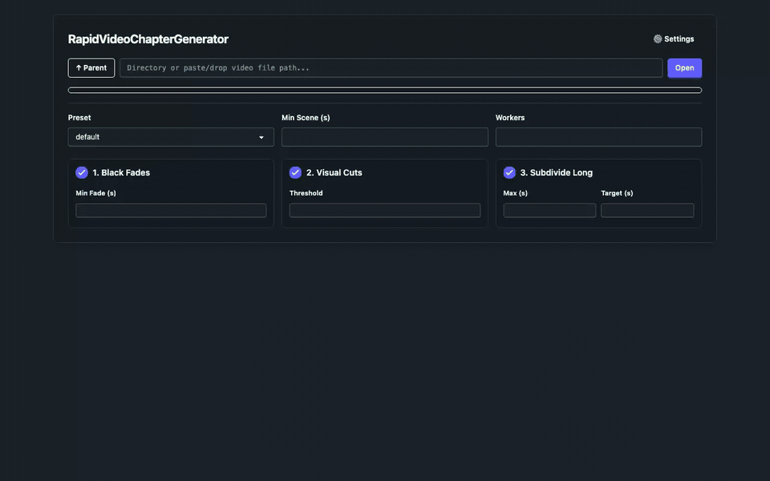

# RapidVideoChapterGenerator

> **Scan multi-hour videos in seconds, browse every scene in a 3×3 interactive contact grid, and inject native chapter markers with one command — zero re-encoding, zero quality loss.**

[](https://opensource.org/licenses/MIT)
[](https://python.org)
[](#performance-benchmark)
[](#5-architectural-philosophy-keyframe-first-hybrid-pipeline)
[](#4-installation--safety-boundaries)
[](https://github.com/dev-ansung/RapidVideoChapterGenerator/stargazers)

[](docs/demo.mp4)

---

## 1. The Problem vs. One-Liner Fix

Long-form video files (movies, VOD streams, lectures, raw recordings) without chapter markers are painful to navigate, and existing tools force a choice between slow full-frame decoding or destructive re-encoding:

* **Blind timeline scrubbing:** Dragging a 2-pixel playhead across a 4-hour MP4 trying to find where a specific scene starts (`"Was that at 01:14:00 or 02:38:00?"`).
* **20–45 minute full-frame scene scans:** Traditional detectors (`PySceneDetect`, standard `ffmpeg select`) decode every single frame of a 1080p/4K stream, pegging all CPU cores for half an hour on a single movie.
* **Destructive NLE / HandBrake workflows:** Importing multi-GB files into an editor just to add chapter markers triggers full re-encodes (`2+ hours`, generational quality loss, stripped HDR/Dolby Vision metadata).
* **Over-fragmented chapters:** Naive scene-score thresholds create 400+ micro-chapters during fast action while leaving 45-minute dead zones during dialogue.

### The One-Liner Fix

```bash
# Launch the interactive Web Lifecycle Studio (browse, preview scenes, edit, and mux on click)
uvx --from git+https://github.com/dev-ansung/RapidVideoChapterGenerator.git rapid-chapters

# Or detect scenes and inject native MP4/MKV chapters in-place in seconds
uvx --from git+https://github.com/dev-ansung/RapidVideoChapterGenerator.git rapid-chapters input.mp4
```

**Using an AI Coding Agent (Claude Code, Cursor, Antigravity, OpenClaw)?** Paste this single prompt:

```text
Install and run https://github.com/dev-ansung/RapidVideoChapterGenerator via `uvx --from git+https://github.com/dev-ansung/RapidVideoChapterGenerator.git rapid-chapters` to detect and embed lossless chapter markers.
```

---

## 2. Core FAQ & Compatibility Matrix

### Quick Answers

| Question | Answer |
| :--- | :--- |
| **Does it re-encode or degrade video quality?** | **Never.** Muxing uses `ffmpeg -c copy -movflags +faststart`. Video bitstreams, audio tracks, HDR/Dolby Vision metadata, and subtitles are copied bit-for-bit. |
| **Does the Web UI modify my video automatically?** | **No.** Scanning in the Web Studio is 100% read-only. Chapters are only written into the video file if you explicitly click **`Embed Chapters`**. |
| **How fast is a 3-hour movie or 11-hour VOD?** | **~3–4 seconds** for a 3-hour movie (`Titanic 720p`), **~12 seconds** for an 11.5-hour 1080p archive (~3,400× real-time on Apple Silicon). |
| **What if the video already has embedded chapters?** | **Instant reuse (`<50 ms`).** Existing chapters are detected via `ffprobe` and loaded immediately unless `--refresh` (or **`↻ Re-Detect`**) is clicked. |
| **Does it support Unicode/CJK filenames and `.srt` subtitles?** | **Yes.** Full macOS NFD / Linux NFC Unicode path resolution and automatic external `.srt`/`.vtt` + embedded subtitle track extraction. |

### Player & Platform Matrix

| Target / Platform | Out-of-the-Box Behavior | Mechanism / Format | How to Use |
| :--- | :--- | :--- | :--- |
| **Web Lifecycle Studio** | Full 9-cell `3×3` Grid & `144:9` List browser + movable player | Local HTTP Range + SSE | `rapid-chapters` (no arguments) |
| **IINA / mpv** | Native timeline chapter ticks & chapter menu | Container atoms (`chpl` / `FFMETADATA1`) | `rapid-chapters video.mp4` |
| **QuickTime Player / Apple TV** | Native chapter selector dropdown & scrub markers | MP4/MOV `chpl` + track reference | `rapid-chapters video.mp4` |
| **VLC Media Player** | Native `Playback ▸ Chapters` navigation | MP4 / MKV / MOV chapter atoms | `rapid-chapters video.mp4` |
| **Plex / Jellyfin / Emby** | Automatic chapter list & scene jumping | Container chapter metadata | `rapid-chapters video.mp4` |
| **YouTube Descriptions** | Copy-ready `HH:MM:SS - Title` chapter list | Plain text (`youtube`) | `rapid-chapters video.mp4 -f youtube` |
| **Podcasting 2.0 / Automation** | Structured start/end/duration/title manifest | `json` / `csv` / `ffmetadata` | `rapid-chapters video.mp4 -f json` |
| **Standalone HTML Archive** | Static zero-server `3×3` contact-sheet gallery | Self-contained HTML + sprite sheet | `rapid-chapters video.mp4 --browse` |

---

## 3. Performance Benchmark

Test environment: **11 hr 35 min (7.2 GB)** 1080p AVC video on Apple Silicon (8 parallel workers).

| Method | Execution Time (11.5h Video) | Execution Time (1h Video) | Output Quality | Manual Effort |
| :--- | :---: | :---: | :---: | :---: |
| Manual Timestamping | 45–90 minutes | 15–30 minutes | 100% | High |
| Full-Frame Scene Detectors (`PySceneDetect`) | 18–35 minutes | 2–4 minutes | 100% | Low |
| Re-encoding / Transcoding Tools | 40–90 minutes | 5–12 minutes | Degraded | Low |
| **RapidVideoChapterGenerator** | **12.0 seconds** | **~1.2 seconds** | **100% (Lossless)** | **None** |

---

## 4. Installation & Safety Boundaries

### Prerequisites

Requires `ffmpeg` (`ffmpeg` and `ffprobe`) in your system `PATH`:

```bash
# macOS
brew install ffmpeg

# Ubuntu / Debian
sudo apt update && sudo apt install ffmpeg

# Windows (winget)
winget install Gyan.FFmpeg
```

### Install Globally or From Source

```bash
# Install globally as a CLI tool via uv (provides `rapid-chapters` and `rvcg`)
uv tool install git+https://github.com/dev-ansung/RapidVideoChapterGenerator.git

# Or clone and install in editable mode
git clone https://github.com/dev-ansung/RapidVideoChapterGenerator.git
cd RapidVideoChapterGenerator
uv pip install -e .
```

### Safety & Non-Destructive Modes

* **Read-Only Web Preview (`rapid-chapters`):** Opening and scanning any video in the Web Studio only writes temporary sprite sheets to your OS temp directory (`/tmp/rvcg_browser_<hash>`). Your source video file is never modified unless you click **`Embed Chapters`**.
* **Read-Only Text Export (`-f youtube | json | csv | ffmetadata`):** Prints chapter markers to `stdout` (or `-o chapters.txt`) without touching the media file.
* **Separate Container Output (`-o output.mp4`):** Writes the chapter-muxed video to a new file path, preserving the original file untouched.
* **Crash-Safe Atomic In-Place Muxing (`rapid-chapters input.mp4`):** Remuxes into a temporary sibling file (`*.rvcg_tmp.*`) and only performs an atomic `os.replace()` after `ffmpeg` verifies a clean `0` exit status. If interrupted (`Ctrl+C`), the partial temp file is cleaned up and the original video remains intact.

---

## 5. Architectural Philosophy ("Keyframe-First Hybrid Pipeline")

**RapidVideoChapterGenerator** is built on a simple observation: camera cuts, fade-to-blacks, and scene transitions in encoded video streams overwhelmingly trigger or align with GOP keyframes (I-frames). Instead of decoding all 30–60 frames per second at full resolution, the engine partitions the container across parallel `ffmpeg` worker processes that decode **only keyframes** (`-skip_frame nokey`) downscaled to $240\times 135$, extracting both visual boundary signals and timeline sprite strips in a single pass.

```text
src/rvcg/
├── cli.py        ▸ Entrypoint & mode router (Web Studio vs. CLI batch vs. static browser)
├── server.py     ▸ ThreadingHTTPServer (Range media streaming, SSE scan jobs, REST chapter ops)
├── probe.py      ▸ ffprobe duration fallback chain + embedded chapter & subtitle extraction
├── scanner.py    ▸ N-worker parallel I-frame scanner (blackdetect + scene score + sprite strips)
├── solver.py     ▸ 5-stage hybrid boundary solver (anchors ▸ gap subdivision ▸ tail merge ▸ 9-cell sample)
├── muxer.py      ▸ FFMETADATA1 manifest builder + crash-safe atomic `-c copy` container remuxer
└── static/
    ├── webui.html    ▸ Two-view Web Lifecycle Studio (Tippy.js file list + 3×3 browser + interact.js player)
    └── browser.html  ▸ Standalone zero-server HTML5 3×3 contact-sheet browser
```

---

## 6. Algorithm & Tool Selection Rationale

| Stage / Component | Primary Mechanism | Fallback / Secondary | Technical Rationale |
| :--- | :--- | :--- | :--- |
| **1. Duration & Metadata Probe** | `ffprobe` format duration | Stream duration ▸ `HH:MM:SS` tags | Handles MKV/WebM files where container-level duration is reported as `"N/A"`. |
| **2. Parallel Visual Scan** | `ffmpeg -skip_frame nokey` + `scale=240:135:flags=fast_bilinear` | Single-pass `split=2` filtergraph | Bypasses P/B-frame inter-prediction decoding for a ~30–50× speedup while simultaneously rendering thumbnail strips. |
| **3. Priority Anchor Placement** | Fade-to-black midpoints (`blackdetect`) | High-scoring visual cuts (`scene > th`) | Black fades represent deliberate editorial act breaks; visual cuts fill remaining gaps while respecting `--min-scene-len`. |
| **4. Long-Segment Subdivision** | Local visual cut snapping ($\pm 45\text{s}$ window) | Uniform target-length split | Prevents 30-minute unchaptered stretches in dialogue-heavy films while still landing splits on real camera cuts. |
| **5. Container Remux** | `ffmpeg -c copy -movflags +faststart` | Atomic sibling temp file + `os.replace` | Zero-transcode container update in $<1\text{s}$ with web-optimized `moov` atom placement and crash safety. |
| **6. Interactive Web UI** | `Video.js` + `interact.js` + `Tippy.js` | Native HTML5 `<video>` cell previews | Provides a freely movable, 8-edge resizable floating player, unclipped filename tooltips, and 9-cell `3×3` scene cards. |

---

## 7. Lifecycle Management & CLI Reference

### Preset Profiles

```bash
# Default (movies & general video: min 3m, max 10m, target 6m, threshold 0.38)
rapid-chapters movie.mp4

# Podcast / Interview (avoids splits on frequent camera switches: min 2m, max 15m, threshold 0.45)
rapid-chapters interview.mp4 --preset podcast

# Presentation / Lecture (captures slide transitions: min 1m, max 10m, threshold 0.30)
rapid-chapters lecture.mp4 --preset presentation

# Action / Fast-Paced (tighter chapter intervals: min 1.5m, max 7m, threshold 0.35)
rapid-chapters gameplay.mp4 --preset action
```

### CLI Options

```text
Usage: rapid-chapters [OPTIONS] [INPUT_VIDEO]

Arguments:
  [INPUT_VIDEO]                   Path to target video file (omit to launch Web Lifecycle Studio)

Detection Controls:
  -t, --threshold FLOAT           Visual cut sensitivity (0.0 to 1.0) [default: 0.38]
  -m, --min-scene-len DURATION    Minimum duration between chapters (e.g. 180, 3m) [default: 180]
  -M, --max-scene-len DURATION    Maximum duration before smart subdivision (e.g. 600, 10m) [default: 600]
  --target-scene-len DURATION     Target duration when subdividing long gaps (e.g. 360, 6m) [default: 360]
  --preset [default|podcast|presentation|action]
                                  Predefined detection sensitivity profile
  -w, --workers INT               Parallel FFmpeg keyframe worker count [default: 8]

Output & UI Options:
  -o, --output PATH               Destination file path (defaults to atomic in-place update)
  -i, --in-place                  Inject chapter markers directly into input file (default for mp4 mode)
  -f, --format [mp4|youtube|ffmetadata|json|csv]
                                  Output mode [default: mp4]
  --title-template TEXT           Chapter naming template [default: "Scene {n:02d}"]
  --ui                            Launch Web Lifecycle Studio server
  --browse                        Launch standalone 3x3 HTML5 scene browser after CLI processing
  --cli-prompt                    Use interactive terminal prompt when no video is given
  --port INT                      Port for Web Lifecycle Studio [default: auto]
  --no-open                       Do not open browser window automatically
  --refresh                       Force re-scan even if embedded chapters or cached browser exist
```

### Cache & Uninstallation

```bash
# Clear cached sprite sheets and temporary browser assets
rm -rf "${TMPDIR:-/tmp}"/rvcg_browser_*

# Uninstall global CLI tool
uv tool uninstall rapid-video-chapter-generator
```

---

## 8. Credits & License

* **Upstream Open-Source Credits:** Built on top of [FFmpeg](https://ffmpeg.org/), [Video.js](https://videojs.com/), [interact.js](https://interactjs.io/), [Tippy.js](https://atomiks.github.io/tippyjs/), and [Rich](https://github.com/Textualize/rich).
* **Star & Contribute:** If **RapidVideoChapterGenerator** saves you time navigating long videos, consider starring the repository! Issues and pull requests are welcome.
* **License:** Released under the [MIT License](LICENSE).
